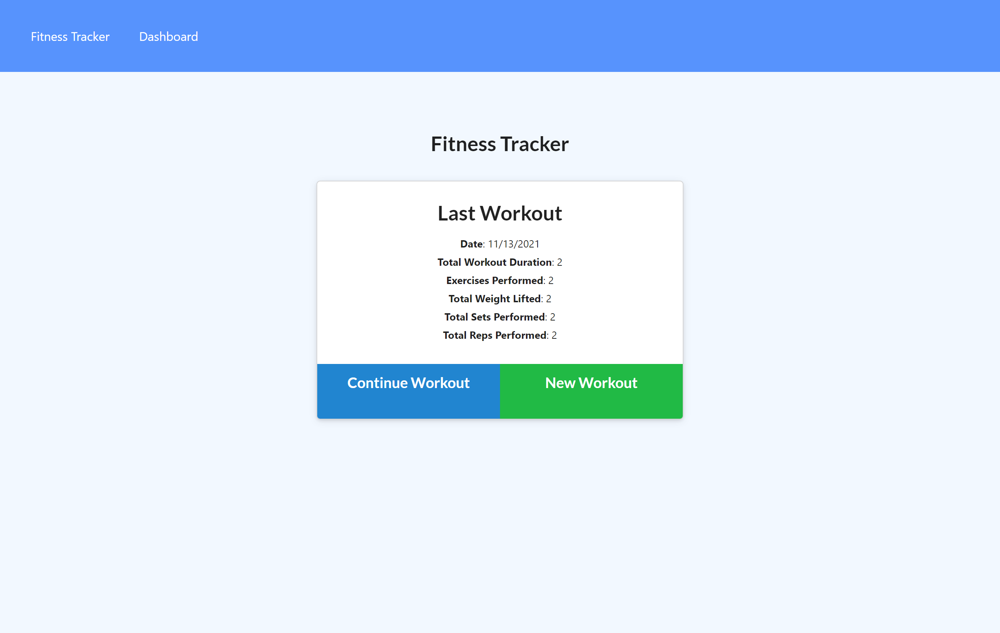
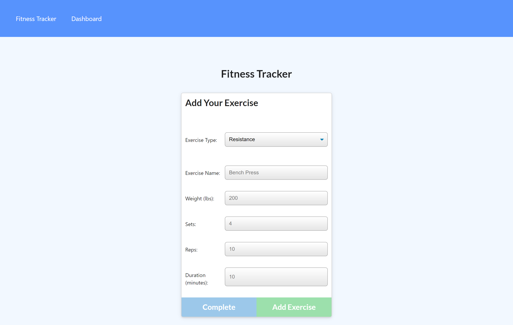
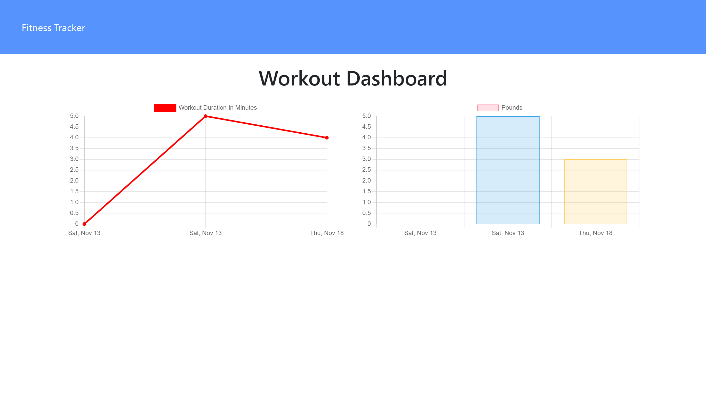

# Track Workouts

[](https://opensource.org/licenses/MIT)


<p align="center">
    
    
</p>
<p align="center">
    
    
    
    
    
    
    
</p>
   

# Description
The Track Workout app helps users track their exercises. Users add new workouts or update their current workout, ranging from resistance workouts to cardio workout with specific user values for each category; duration, distance, weight, reps, and sets. The Track Workout is a NodeJS based application that uses MongoDB and is deployed on Heroku 


## Table of Contents
- [Overview](#overview)
- [Authors](#authors)
- [Demo](#demo)
- [Preview](#preview)
- [Features](#features)
- [Installation](#installation)
- [Contribution](#contribution)


## Authors
 - Author: Sophia
 - GitHub: [soph-k](https://github.com/soph-k)
- Version 1.1


## Demo
[Demo Heroku](https://sophk-track-workout.herokuapp.com/)


## Preview





## Features
- HTML
- CSS
- Javascript 
- Node.js 
    - Express
- MongoDB


## Repo
[Repo](https://github.com/soph-k/track-workouts)

## Installation
Before using commands please be sure the NodeJS packages are installed. 
If not, run the following commands in the following order: 
```
npm init
```


## Contribution
Contributions are accepted. Feel free to fork without permission.


## License
This project is under the MIT license.


###
For questions about this project, please review my GitHub repo at [soph-k](https://github.com/soph-k) or contact me on Github.


#### Bugs 
- No known bugs.


